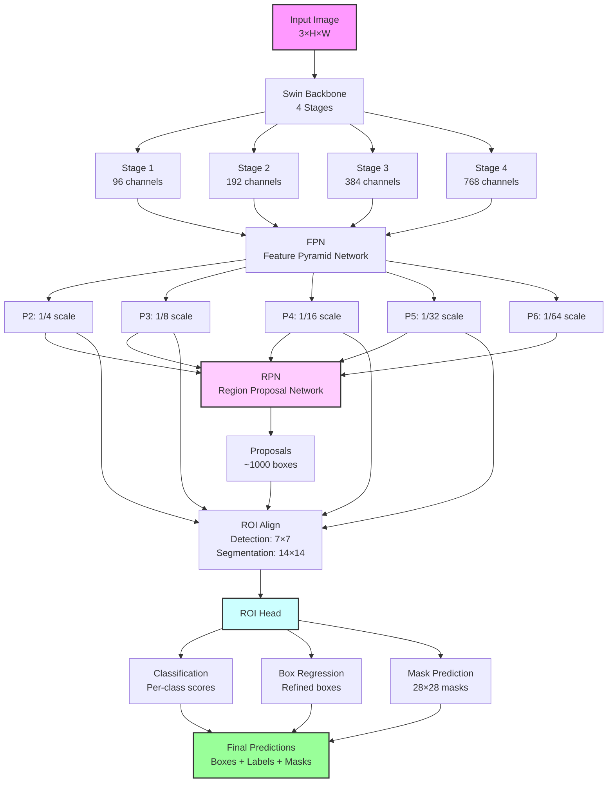
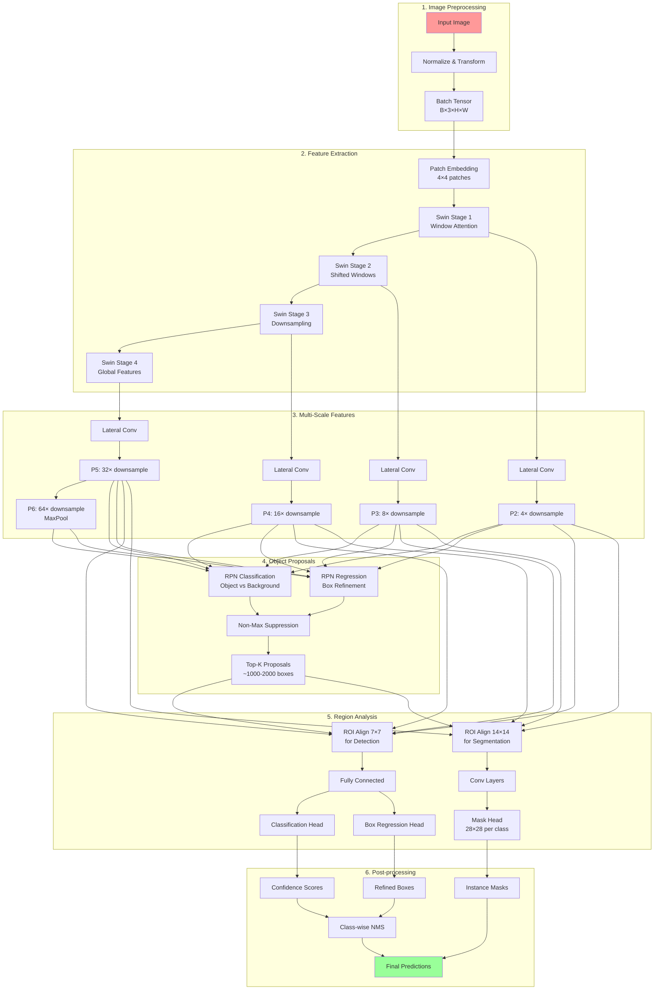
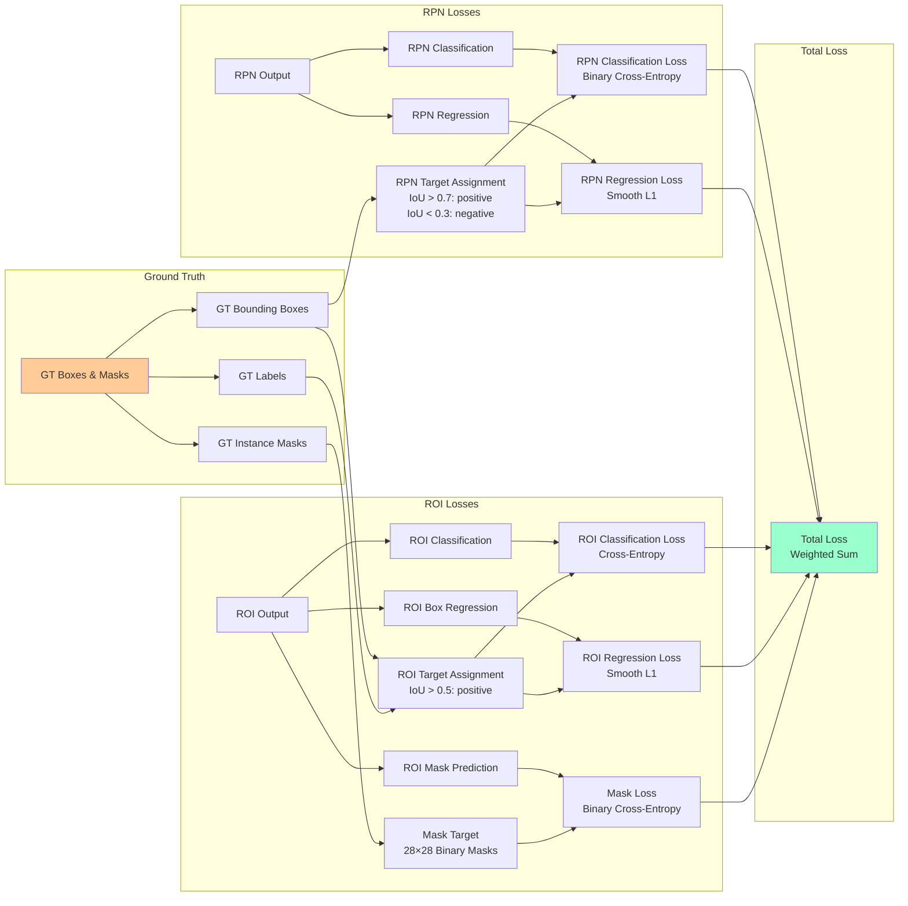

# SWIN Mask R-CNN

A clean, standalone implementation of SWIN-based Mask R-CNN without dependencies on mmcv, mmengine, or mmdetection packages. This implementation provides a modular, easy-to-understand codebase for instance segmentation tasks.

## Features

### Model Architecture
- **SWIN Transformer Backbone**: Full implementation from scratch with configurable depths and dimensions
- **Feature Pyramid Network (FPN)**: Multi-scale feature extraction for improved detection
- **Region Proposal Network (RPN)**: Efficient object proposal generation with configurable IoU thresholds
- **ROI Head**: Combined detection and segmentation head with mask prediction
- **Configurable Architecture**: Easily adjust model components and hyperparameters

### Training Capabilities
- **Iteration-based Validation**: Validate at specific training steps rather than just epochs
- **COCO Evaluation Metrics**: Full integration with COCO evaluation for comprehensive mAP metrics
- **Gradient Clipping**: Prevent gradient explosion during training
- **Mixed Precision Training**: Optional automatic mixed precision (AMP) support
- **Multiple Optimizers**: Support for both AdamW and SGD optimizers
- **Learning Rate Scheduling**: OneCycleLR scheduler with warmup
- **GPU Monitoring**: Real-time GPU utilization and memory tracking

### Backbone Control
- **Pretrained Weights Support**: Load pretrained SWIN backbone weights from mmdetection
  - Default weights: Swin-S trained on COCO
  - URL: https://download.openmmlab.com/mmdetection/v2.0/swin/mask_rcnn_swin-s-p4-w7_fpn_fp16_ms-crop-3x_coco/mask_rcnn_swin-s-p4-w7_fpn_fp16_ms-crop-3x_coco_20210903_104808-b92c91f1.pth
  - Automatic download and conversion from mmdetection format
- **Flexible Freezing**: Fine-grained control over backbone layer freezing
  - Freeze 0-4 stages of the SWIN backbone
  - Default: 2 stages frozen for optimal transfer learning
  - Configurable via `frozen_backbone_stages` parameter
- **Memory Efficient**: Frozen layers don't compute gradients

### Data Pipeline
- **COCO Dataset Support**: Full COCO format annotation support
- **CMR Dataset Support**: Custom dataset format for medical imaging
- **Flexible Transforms**: Comprehensive data augmentation pipeline
- **Efficient Collation**: Custom collate function for variable-sized inputs
- **Multi-worker Loading**: Parallel data loading for improved throughput

### Configuration Management
- **Pydantic Configuration**: Type-safe configuration with automatic validation
- **YAML Support**: Easy configuration via YAML files
- **Parameter Validation**: Automatic bounds checking and type validation
- **Flexible Training Scripts**: Multiple entry points for different use cases

### Monitoring & Debugging
- **Comprehensive Logging**: Detailed loss breakdowns (RPN cls/bbox, ROI cls/bbox/mask)
- **Progress Tracking**: TQDM progress bars with live statistics
- **Training History**: Complete history of all metrics across training
- **Validation Metrics**: COCO mAP, mAP@50, mAP@75, segmentation mAP

### Checkpointing & Recovery
- **Flexible Saving**: Save checkpoints by epoch or iteration
- **Best Model Tracking**: Automatically save best performing models based on mAP
- **Model Export**: Export trained models for inference
- **State Management**: Save complete training state for resumption

### Inference Pipeline
- **Batch Inference**: Process multiple images simultaneously
- **Post-processing**: NMS and score thresholding
- **FiftyOne Integration**: Visualize predictions with interactive tools
- **Export Formats**: Save predictions in COCO format

## Project Structure

```
swin_maskrcnn/
├── swin_maskrcnn/          # Main package directory
│   ├── models/             # Neural network architectures
│   ├── data/               # Data loading and transforms
│   ├── training/           # Training logic
│   ├── inference/          # Inference utilities
│   ├── callbacks/          # Training callbacks  
│   └── utils/              # Utilities
├── scripts/                # Standalone scripts
│   ├── config/             # Configuration files
│   ├── debug/              # Debug and diagnostic scripts
│   └── tests/              # Test scripts for validation
├── tests/                  # Unit tests
├── examples/               # Usage examples
├── docs/                   # Documentation
├── logs/                   # Training and debug logs
├── checkpoints/            # Model checkpoints
└── predictions/            # Prediction outputs
```

## Installation

```bash
# Clone the repository
git clone <repository-url>
cd swin_maskrcnn

# Install with uv (recommended)
uv pip install -e ".[dev]"

# Or with standard pip
pip install -e ".[dev]"
```

## Quick Start

### Training with Configuration

```bash
# Using the main training script with YAML config
python scripts/train.py --config scripts/config/config.yaml

# Or use defaults for CMR dataset
python scripts/train.py
```

### Configuration File

Example `config.yaml`:

```yaml
# Dataset paths
train_ann: /path/to/train/annotations.json
val_ann: /path/to/val/annotations.json
img_root: /path/to/images

# Model parameters
num_classes: 69
pretrained_backbone: true
pretrained_checkpoint_url: https://download.openmmlab.com/mmdetection/v2.0/swin/mask_rcnn_swin-s-p4-w7_fpn_fp16_ms-crop-3x_coco/mask_rcnn_swin-s-p4-w7_fpn_fp16_ms-crop-3x_coco_20210903_104808-b92c91f1.pth
frozen_backbone_stages: 2  # Default: freeze first 2 stages

# Training parameters
train_batch_size: 4
val_batch_size: 8
num_workers: 0
lr: 0.0001
num_epochs: 12

# Iteration-based validation
steps_per_validation: 200
validation_start_step: 1000

# Optimizer settings
optimizer: adamw  # or 'sgd'
use_scheduler: true
clip_grad_norm: 10.0

# Checkpointing
checkpoint_dir: ./test_checkpoints
log_interval: 50
```

### Programmatic Usage

```python
from swin_maskrcnn.models.mask_rcnn import SwinMaskRCNN
from scripts.config.training_config import TrainingConfig
from scripts.train import main

# Create configuration
config = TrainingConfig(
    train_ann='/path/to/train.json',
    val_ann='/path/to/val.json',
    img_root='/path/to/images',
    num_classes=80,
    frozen_backbone_stages=2,  # Freeze first 2 stages
    train_batch_size=4,
    lr=0.0001
)

# Train model
main(config)
```

### Inference

```bash
# Run inference from command line
python scripts/inference.py \
    --model-path checkpoints/best.pth \
    --images /path/to/image1.jpg /path/to/image2.jpg \
    --score-threshold 0.5 \
    --nms-threshold 0.5
```

Python API:

```python
from swin_maskrcnn.models.mask_rcnn import SwinMaskRCNN
from swin_maskrcnn.inference.predictor import Predictor
import torch

# Load model
model = SwinMaskRCNN(num_classes=80)
model.load_state_dict(torch.load('checkpoint.pth'))

# Create predictor
predictor = Predictor(model, device='cuda')

# Run inference
predictions = predictor.predict(
    image_paths=['image1.jpg', 'image2.jpg'],
    score_threshold=0.5,
    nms_threshold=0.5
)
```

## Advanced Features

### Pretrained Weights

The model can automatically load pretrained weights from mmdetection:

```python
# Using default Swin-S COCO weights
config = TrainingConfig(
    pretrained_backbone=True,  # Enable pretrained weights
    pretrained_checkpoint_url="https://download.openmmlab.com/mmdetection/v2.0/swin/mask_rcnn_swin-s-p4-w7_fpn_fp16_ms-crop-3x_coco/mask_rcnn_swin-s-p4-w7_fpn_fp16_ms-crop-3x_coco_20210903_104808-b92c91f1.pth"
)

# Or use custom weights
config = TrainingConfig(
    pretrained_backbone=True,
    pretrained_checkpoint_url="path/to/your/checkpoint.pth"
)
```

### Backbone Freezing Strategies

Control which layers are trainable:

```python
# No freezing - train entire model
config = TrainingConfig(frozen_backbone_stages=-1)

# Freeze patch embedding only
config = TrainingConfig(frozen_backbone_stages=0)

# Freeze first 2 stages (default)
config = TrainingConfig(frozen_backbone_stages=2)

# Freeze entire backbone
config = TrainingConfig(frozen_backbone_stages=4)
```

### Iteration-based Validation

Validate at specific training steps:

```python
config = TrainingConfig(
    steps_per_validation=200,  # Validate every 200 steps
    validation_start_step=1000  # Start validation after 1000 steps
)
```

### Custom Dataset Support

The framework supports both COCO and custom dataset formats:

```python
from swin_maskrcnn.data.dataset import CocoDataset

# COCO format
dataset = CocoDataset(
    root_dir='/path/to/images',
    annotation_file='/path/to/annotations.json',
    transforms=get_transform_simple(train=True),
    mode='train'
)

# Custom format (requires adapter)
dataset = CustomDataset(
    data_dir='/path/to/data',
    transforms=get_transform_simple(train=True)
)
```

## Architecture Details

### Architecture Overview



### Detailed Data Flow



### Training Loss Computation



### Model Components

1. **SWIN Backbone**
   - 4 stages with depths [2, 2, 6, 2]
   - Window size: 7x7
   - Patch size: 4x4
   - Embedding dimensions: 96 → 192 → 384 → 768

2. **FPN Neck**
   - 5-level feature pyramid
   - 256 output channels
   - Top-down pathway with lateral connections

3. **RPN Head**
   - 3 aspect ratios per location
   - IoU thresholds: 0.7 (positive), 0.3 (negative)
   - NMS threshold: 0.7

4. **ROI Head**
   - 7x7 ROI align for detection
   - 14x14 ROI align for segmentation
   - Class-specific box regression

## Development

### Testing

```bash
# Run all tests
pytest tests/

# Run specific test
pytest tests/test_model.py

# With coverage
pytest tests/ --cov=swin_maskrcnn --cov-report=html
```

### Code Quality

```bash
# Format code
black .

# Lint
ruff check .

# Type check
mypy swin_maskrcnn/
```

### Contributing

1. Fork the repository
2. Create a feature branch
3. Add tests for new functionality
4. Ensure all tests pass
5. Submit a pull request

## License

MIT License - see LICENSE file for details

## Acknowledgments

- SWIN Transformer paper authors
- PyTorch and torchvision teams
- COCO dataset maintainers

## Citation

If you use this code in your research, please cite:

```bibtex
@software{swin_maskrcnn,
  title={SWIN Mask R-CNN: A Standalone Implementation},
  year={2024},
  url={https://github.com/yourusername/swin_maskrcnn}
}
```